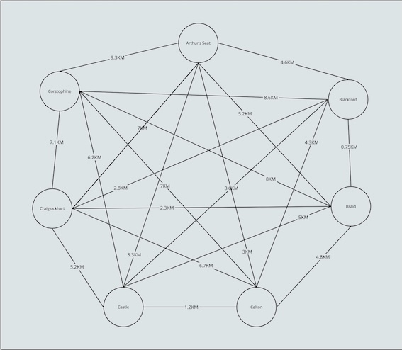
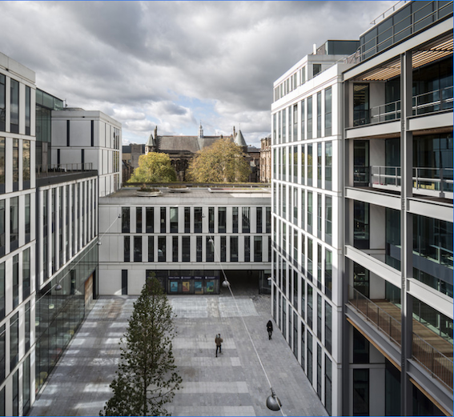
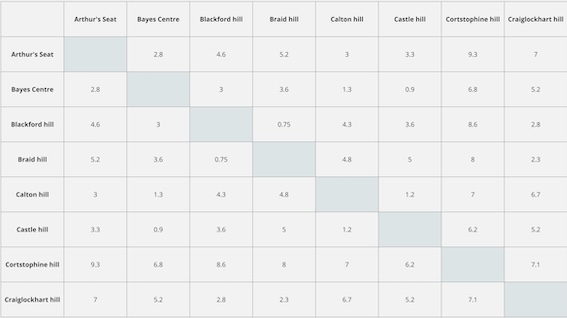

# Seven Hills of Edinburgh

## Race & Challenge

Each year, on a weekend in June, a gaggle of runners/masochists run a (roughly) 25KM tour of each of the seven hills in Edinburgh, with 2200 feet of ascent/descent.
The route they take is up to them but they must hit each of the hills in a certain order. Starting and ending at Calton hill. 

Last year's winner ran a time of 99 minutes. There's a _race_ race and a challenge.

Further information [here](https://www.seven-hills.org.uk/) if any #fitness Hippo's fancy it!

## The Hippo's hoofprints

...We've also gathered distances between each of the seven hills (as measured by Google Maps directions on foot).
If anyone can be rumped, we've knocked up a couple of challenges using the data.

We used the following Google Maps locations to calculate distances:

1. Arthur's Seat
2. Calton hill
3. Edinburgh Castle
4. Blackford hill
5. Hermitage of Braid
6. Wester hill (Craiglockhart)
7. Corstophine hill

Our hippo only made it to six of the seven hills of Edinburgh (sorry Craiglockhart) due to certain _slide constraints_.

---

_Craiglockhart hill is split into two (easter and wester)...that's about all there is to say about it_

---

They took the following route:

### The Route

0. Braid  hill (Start)
1. Blackford hill (0.75KM)
2. Castle hill (4.35KM)
3. Calton hill (5.55KM)
4. Arthur's Seat (8.55KM)
5. Corstophine hill (17.85KM)

### _A quicker route_

Can you find a route that takes them to the same 6 hills without quite so much trotting?

### _The Bayes Centre_

Our Hippo is currently staying at the Bayes centre and starts and ends each day there.
Can you plan a day out which takes our Hippo
to _each of the seven_ hills
and _starts and ends at the Bayes centre_
and _minimises_ the amount of plodding?

#### Updated distances

### _Proper Tourist_

Our Hippo would also like to visit the following:

1. Royal Yacht Britannia
2. Crammond island
3. Portobello beach
4. Botanic Gardens

Reckon they could get it all done in 1 day?
should they extend their trip?

### _Is the runners route optimal_?

Seven hills runners take the following route, beginning and ending at the top of Calton hill.

0. Calton hill (Start)
1. Castle hill (1.2KM)
2. Corstophine hill (7.4KM)
3. Craiglockhart hill East (14.5KM)
4. Braid hill (16.8KM)
5. Blackford hill (17.55KM)
6. Arthur's Seat (22.15KM)
7. Calton hill (25.15KM)
